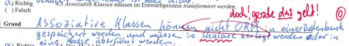

SE Fragen
=========

#### Durch die Verwendung des Entwurfsmusters *Strategie* erhöht sich die Anzahl der Objekte. (SS2014 NK)

**Richtig.**

> Für jeden Algorithmus wird eine neue Klasse erstellt und darin neue Objekte erzeugt.

#### Verwaltungsmethoden wie `get()` und `set()` sind im *Klassendiagram* eines *Entwurfsmodells* zu modellieren. (SS2014 NK)

**Richtig.**

> ebenso wie `insert()` und `update()`

#### Verwaltungsmethoden wie `get()` und `set()` sind im *Klassendiagram* eines *Entwurfsmodells* nicht zu modellieren. (WS2010)

**Falsch.**

> ebenso wie `insert()` und `update()`

#### Die *Kann-Kriterien* aus dem Pflichtenheft werden im Entwurfsmodell *nicht länger berücksichtigt*. (SS2014 NK)

**Falsch.**

> Sie werden berücksichtigt, es sollte aber baldmöglichst entschieden werden ob (Zie: **wann**) sie realisiert werden

*Zie hatte das "ob" durchgestrichnen und "wann" druntergeschrieben*

#### Die *Kann-Kriterien* aus dem Pflichtenheft werden im Entwurfsmodell *nicht länger berücksichtigt*, da sie im fertigen Softwareprodukt mit hoher Wahrscheinlichkeit nicht realisiert sein werden. (WS2011) (SS2013)

**Falsch.**

> Die Kann Kriterien werden genau wie die Muss-Kriterien im Entwurfsmodell berücksichtigt.

#### Objektorientierte Vererbung lässt sich nicht auf relationale Datenmodelle abbilden. (SS2014 NK)

**Falsch.**

> Es gibt 3 Arten: `JOINED`, `TABLE-PER-CLASS` und `SINGLE-TABLE`

#### Objektorientierte Vererbung lässt sich *auch auf relationale Datenmodelle* abbilden (WS2010)

**Richtig.**

> Es gibt 3 Typen => Single, Table-per-class und joined

#### Ein Web-Server funktioniert nach dem *HTTP-Request-Response-Paradigma*. Das klassische *Model-View-Controller-Konzept* lässt sich hier nicht anwenden. (SS2014 NK)

**Falsch.**

> es lässt sich ab HTML5 anwenden, ist nur richtig, wenn der Webserver ohne HTML5 arbeitet

*Gruselige Begründung*

#### Eine Klasse kann entweder *ganz* oder *gar nicht* persistent sein. (SS2014 NK)

**Falsch.**

> Attribute können transient sein.

#### In einer Klasse ist es auch möglich, *nur einzelne Attribute* zu persistieren (WS2011)

**Richtig.**

> Attribute die nicht persistent sein sollen mit `@Transient` versehen.

#### In der Programmiersprache *Java* gibt es keine *Mehrfachvererbung*. (SS2014 NK)

**Richtig.**

> eine Klasse kann nur von einer anderen Klasse erben

#### Im Klassendiagramm des Entwurfs sollten möglichst viele *Assoziationen unidirektional* sein (SS2014 NK)

**Richtig.**

> Bidirektionalität ist sehr aufwändig

*Zie: gerade so...*

*Gruselige Begründung*

#### Die *Fachlogikschicht* in der *Drei-Schichten-Architektur* darf auf die *darunter liegenden Schichten* zugreifen, jedoch nicht auf die *darüber liegenden*. (SS 2013)

**Richtig.**

> Da die View sich die Information von der Lg Schicht holt und die Schichten so getrennt sind dass es keinen Sinn ergeben würde wenn es andersrum wäre

#### Es findet eine automatische *Wertzuweisung* zwischen den Attributen der Backing Bean und den korrespondierenden Interaktionselemente der Benutzungsoberfläche statt. (SS 2013)

**Richtig.**

> Das Framework kümmert sich darum, allerdings kann man auch die Beans selber konfigurieren mit @Selection ....

#### Der *Entwurf* ist die Strukturierung des Softwaresystems aus *Anwendersicht*

**Falsch.**

*Zie: aus Entwicklersicht*

#### *Beans* haben stets *die Lebensdauer "request"*. (WS2011)

**Falsch.**

> Sie können auch Sessionscoped, Sitescoped und an die Lebensdauer der Webanwendung gebunden sein. (WS2011)
>
> es gibt auch page, application und session (WS2010)

#### Das Entwurfsmuster *Singleton* ist ein *objektbasiertes Erzeugungsmuster*. (WS2011)

**Richtig.**

> Es kann dadurch nur eine Instanz eines Objektes geben. `Object.getInstanz();`

#### Das Entwurfsmuster *Singleton* ist ein *klassenbasiertes Erzeugungsmuster*. (WS2010)

**Falsch.**

> ist ein objektbasiertes Erzeugungsmuster

#### Ein *fachlich relevantes, eindeutiges* Attribut wie `kundenNr` oder `artikelId` ist als *Schlüsselattribut* der Datenbanktabelle einer Entitätsklasse *nicht geeignet*. (WS2011)

**Richtig.**

> Das sich die Fachlichkeit ändern kann und die OID nicht mit der Fachlogik verbunden werden soll.

#### Ein *fachlich relevantes, eindeutiges* Attribut wie `kundenNr` oder `artikelId` ist als *Schlüsselattribut* (primary key) der Datenbanktabelle einer Entitätsklasse *besonders geeignet*. (WS2010) (SS2013)

**Falsch.**

> ein generischer Schlüssel ist besser geeignet.

#### Ein *Phase Listener* ermöglicht es, die Berechtigung des Benutzers beim Zugriff auf eine Webseite vom *Web Framework* "JavaServer Faces" überprüfen zu lassen. (WS2011)

**Richtig.**

> der Phasenlistener kann in die einzelnen Phasen der JSF eingebunden werden (after Phase, before Phase) um zu prüfen ob ein Benutzer angemeldet ist oder nicht.

*Ich geh hart davon aus dass das nicht drankommt!*

#### *Assoziative Klassen* müssen im Entwurfsprozess *transformiert* werden. (WS2011)

#### *Assoziative Klassen* müssen im Entwurfsprozess *eliminiert* werden (SS2013)

#### Das *Model-View-Controller-Konzept (MVC)* bezieht sich auf *alle drei Schichten* der im Entwurfsmodell eingesetzten Drei-Schichten-Architektur. (WS2011) (SS2013)

**Falsch.** *Zie war so freundlich und hat in SS2013 gesagt dass die Aussage falsch ist*

#### *Data Binding* bezeichnet die *automatische Wertzuweisung* zwischen Beans-Attributen und UI-Elementen (WS2010)

#### Im ORM vermeidet man es soweit wie möglich, künstliche (numerische) Primärschlüsssel zu vergeben. (WS2009 Probeklausur)

#### Persistente und nicht persistente Entitäten unterscheiden sich durch die Art ihrer Annotationen. (WS2009 Probeklausur)

#### Die Lebensdauer eines Managed Bean ergibt sich automatisch aus der Lebensdauer der zugehörigen JSP-Seite. (WS2009 Probeklausur)

#### Durch eine Dateiprüfsumme kann Manipulation im Abnahmetest verhindert werden. (WS2009 Probeklausur)

#### Unter einer Persistence Unit versteht man die Verwaltung des Datenbankzugangs. (WS2009 Probeklausur)

#### Der Übergang vom Analysemodell zum Entwurfsmodell kann zielsprachenunabhängig erfolgen. (WS2009 Probeklausur)

#### Dependency Injection ist ein Muster zur losen Kopplung von Komponenten. (WS2009 Probeklausur)

#### In JSF kann die Navigationsstruktur zwischen Webseiten spezifiziert werden. (WS2009 Probeklausur)
